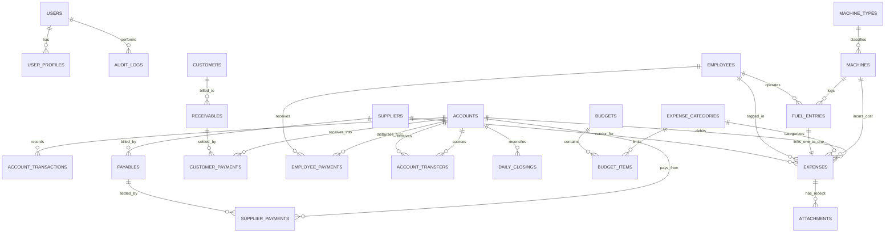

# EXPENSE TRACKING & MANAGEMENT SYSTEM
## Database Schema & Data Dictionary Specification

---

## 1. Schema Overview & Design Principles
The database is architected for **MySQL 8.0 (InnoDB)** with strict ACID compliance.
- **Monetary Precision:** All currency fields use `DECIMAL(15,2)` / Python `decimal.Decimal`. Floating-point types (`FLOAT`, `DOUBLE`) are strictly forbidden.
- **Physical Quantities:** Fuel/lubricant volumes, unit rates, and machine meter readings use `DECIMAL(10,2)`.
- **Central Financial Ledger:** The `account_transactions` table is the authoritative source of truth for all account financial movements.
- **Soft Deletion & Integrity:** Financial tables include `is_deleted` and use `ON DELETE RESTRICT` / `PROTECT` on master relationships to prevent accidental loss of historical records.

---

## 2. Entity Relationship Diagram

---

## 3. Data Dictionary: Detailed Table Specifications

### 1. `auth_user` & `user_profiles`
*Extends Django's native authentication table with canonical business roles.*

| Column | Type | Nullable | Default | Constraints / Relations | Description |
| :--- | :--- | :---: | :--- | :--- | :--- |
| `id` | BIGINT | NO | Auto Inc | PRIMARY KEY | Unique user ID |
| `username` | VARCHAR(150) | NO | | UNIQUE | Login username |
| `email` | VARCHAR(254) | YES | NULL | | User email |
| `role` | VARCHAR(20) | NO | 'EMPLOYEE' | CHECK in ('OWNER','ACCOUNTANT','MANAGER','EMPLOYEE') | Canonical role |
| `phone_number` | VARCHAR(15) | YES | NULL | | Contact mobile number |
| `is_active` | BOOLEAN | NO | 1 | | Active flag |
| `created_at` | DATETIME(6) | NO | CURRENT_TIMESTAMP | | Timestamp |

---

### 2. `accounts` (Business Financial Accounts)
*Stores Cash boxes, Bank accounts, and UPI wallets.*

| Column | Type | Nullable | Default | Constraints / Relations | Description |
| :--- | :--- | :---: | :--- | :--- | :--- |
| `id` | BIGINT | NO | Auto Inc | PRIMARY KEY | Account ID |
| `account_name` | VARCHAR(100) | NO | | UNIQUE | e.g. "Main Cash Box", "SBI Current 4091" |
| `account_type` | VARCHAR(20) | NO | 'BANK_CURRENT'| CHECK in ('CASH','BANK_SAVINGS','BANK_CURRENT','UPI_WALLET','PETTY_CASH') | Account type |
| `account_number`| VARCHAR(50) | YES | NULL | | Bank A/c No / UPI ID (Masked in general UI) |
| `bank_name` | VARCHAR(100) | YES | NULL | | Bank name |
| `ifsc_code` | VARCHAR(20) | YES | NULL | | IFSC Code |
| `opening_balance`| DECIMAL(15,2)| NO | 0.00 | | Starting balance |
| `opening_balance_date`| DATE | NO | | | Date opening balance established |
| `current_balance`| DECIMAL(15,2)| NO | 0.00 | | **Derived cache value** (Must reconcile with ledger) |
| `is_active` | BOOLEAN | NO | 1 | | Active status |
| `created_at` | DATETIME(6) | NO | CURRENT_TIMESTAMP | | Timestamp |
| `updated_at` | DATETIME(6) | NO | CURRENT_TIMESTAMP | ON UPDATE | Timestamp |

---

### 3. `account_transactions` (CENTRAL FINANCIAL LEDGER)
*The authoritative source of truth for all account balance movements.*

| Column | Type | Nullable | Default | Constraints / Relations | Description |
| :--- | :--- | :---: | :--- | :--- | :--- |
| `id` | BIGINT | NO | Auto Inc | PRIMARY KEY | Ledger Entry ID |
| `account_id` | BIGINT | NO | | FK -> `accounts.id` (RESTRICT) | Target financial account |
| `transaction_date`| DATE | NO | | INDEX | Date of monetary movement |
| `transaction_type`| VARCHAR(30) | NO | | CHECK in ('OPENING_BALANCE','INCOME','EXPENSE','RECEIVABLE_PAYMENT','PAYABLE_PAYMENT','EMPLOYEE_PAYMENT','TRANSFER_IN','TRANSFER_OUT','ADJUSTMENT','REVERSAL') | Ledger transaction type |
| `direction` | VARCHAR(10) | NO | | CHECK in ('DEBIT','CREDIT') | Money flow direction |
| `amount` | DECIMAL(15,2)| NO | | CHECK (amount > 0.00) | Monetary value in INR |
| `reference_type`| VARCHAR(50) | YES | NULL | | Source entity type (e.g. 'Expense', 'CustomerPayment') |
| `reference_id` | BIGINT | YES | NULL | | ID of related source record |
| `description` | TEXT | YES | NULL | | Audit narration |
| `created_by_id` | BIGINT | NO | | FK -> `auth_user.id` | User who logged transaction |
| `created_at` | DATETIME(6) | NO | CURRENT_TIMESTAMP | | Timestamp |
| `is_deleted` | BOOLEAN | NO | 0 | INDEX | Soft deletion flag |

---

### 4. `account_transfers` (Internal Inter-Account Transfers)
*Enforces Rule 2: Strictly excluded from Revenue/Expense totals.*

| Column | Type | Nullable | Default | Constraints / Relations | Description |
| :--- | :--- | :---: | :--- | :--- | :--- |
| `id` | BIGINT | NO | Auto Inc | PRIMARY KEY | Transfer ID |
| `transfer_code` | VARCHAR(30) | NO | | UNIQUE | e.g. "TRF-20260815-001" |
| `transfer_date` | DATE | NO | | INDEX | Date transfer occurred |
| `from_account_id`| BIGINT | NO | | FK -> `accounts.id` (RESTRICT) | Source account (Debited) |
| `to_account_id` | BIGINT | NO | | FK -> `accounts.id` (RESTRICT) | Destination account (Credited) |
| `amount` | DECIMAL(15,2)| NO | | CHECK (amount > 0.00) | Transfer amount in INR |
| `reference_no` | VARCHAR(100) | YES | NULL | | UTR / Cheque / Ref Number |
| `notes` | TEXT | YES | NULL | | Transfer notes / purpose |
| `created_by_id` | BIGINT | NO | | FK -> `auth_user.id` | User |
| `created_at` | DATETIME(6) | NO | CURRENT_TIMESTAMP | | Timestamp |
| `is_deleted` | BOOLEAN | NO | 0 | INDEX | Soft delete flag |

---

### 5. `expense_categories` (Categories & Subcategories)
*Hierarchical classification of business expenses.*

| Column | Type | Nullable | Default | Constraints / Relations | Description |
| :--- | :--- | :---: | :--- | :--- | :--- |
| `id` | BIGINT | NO | Auto Inc | PRIMARY KEY | Category ID |
| `name` | VARCHAR(100) | NO | | UNIQUE | Category name |
| `code` | VARCHAR(30) | NO | | UNIQUE | e.g. "CAT-FUEL", "CAT-MAINT" |
| `parent_id` | BIGINT | YES | NULL | FK -> `expense_categories.id` (CASCADE) | For subcategories |
| `color_hex` | VARCHAR(7) | NO | '#10B981' | | Hex color for UI charts |
| `icon_class` | VARCHAR(50) | YES | 'bi-receipt'| | Bootstrap icon class |
| `is_active` | BOOLEAN | NO | 1 | | Active flag |

---

### 6. `expenses` (General & Operational Business Expenses)
*The core transactional expense table.*

| Column | Type | Nullable | Default | Constraints / Relations | Description |
| :--- | :--- | :---: | :--- | :--- | :--- |
| `id` | BIGINT | NO | Auto Inc | PRIMARY KEY | Expense ID |
| `expense_code` | VARCHAR(30) | NO | | UNIQUE | e.g. "EXP-20260815-0042" |
| `expense_date` | DATE | NO | | INDEX | Date incurred |
| `amount` | DECIMAL(15,2)| NO | | CHECK (amount > 0.00) | Net amount in INR |
| `category_id` | BIGINT | NO | | FK -> `expense_categories.id` (RESTRICT) | Category |
| `payment_method`| VARCHAR(20) | NO | 'CASH' | CHECK in ('CASH','BANK_TRANSFER','UPI','CHEQUE','CREDIT') | Canonical payment method |
| `account_id` | BIGINT | YES | NULL | FK -> `accounts.id` (RESTRICT) | Debited account (NULL if CREDIT) |
| `business_segment`| VARCHAR(30)| NO | 'GENERAL'| CHECK in ('GENERAL','FARM_OPERATIONS','MACHINERY_RENTAL','WORKSHOP_REPAIRS','SHOP_RETAIL','GENERAL_ADMIN') | Canonical business segment |
| `machine_id` | BIGINT | YES | NULL | FK -> `machines.id` (SET NULL) | Linked machine (if applicable) |
| `employee_id` | BIGINT | YES | NULL | FK -> `employees.id` (SET NULL) | Linked employee (if applicable) |
| `supplier_id` | BIGINT | YES | NULL | FK -> `suppliers.id` (SET NULL) | Vendor / Supplier |
| `reference_no` | VARCHAR(100) | YES | NULL | | Bill / Tax Invoice / UTR number |
| `description` | TEXT | YES | NULL | | Narrative description |
| `is_quick_expense`| BOOLEAN | NO | 0 | | True if logged via mobile quick entry |
| `is_reversed` | BOOLEAN | NO | 0 | | True if reversed via audit correction |
| `created_by_id` | BIGINT | NO | | FK -> `auth_user.id` | Creator |
| `created_at` | DATETIME(6) | NO | CURRENT_TIMESTAMP | | Timestamp |
| `updated_at` | DATETIME(6) | NO | CURRENT_TIMESTAMP | ON UPDATE | Timestamp |
| `is_deleted` | BOOLEAN | NO | 0 | INDEX | Soft delete flag |

---

### 7. `machine_types` & `machines` (Agricultural Equipment Master)

#### Table: `machine_types`
| Column | Type | Nullable | Default | Constraints | Description |
| :--- | :--- | :---: | :--- | :--- | :--- |
| `id` | BIGINT | NO | Auto Inc | PRIMARY KEY | Machine type ID |
| `name` | VARCHAR(50) | NO | | UNIQUE | Type name |
| `code` | VARCHAR(30) | NO | | UNIQUE | e.g. "TRACTOR", "COMBINE_HARVESTER" |

#### Table: `machines`
| Column | Type | Nullable | Default | Constraints / Relations | Description |
| :--- | :--- | :---: | :--- | :--- | :--- |
| `id` | BIGINT | NO | Auto Inc | PRIMARY KEY | Machine ID |
| `machine_code` | VARCHAR(30) | NO | | UNIQUE | e.g. "MCH-TRAC-01" |
| `name` | VARCHAR(100) | NO | | | Model Name (e.g. "John Deere 5310") |
| `machine_type_id`| BIGINT | NO | | FK -> `machine_types.id` (RESTRICT) | Equipment classification |
| `registration_no`| VARCHAR(50) | YES | NULL | UNIQUE | Vehicle RTO / Chassis Number |
| `status` | VARCHAR(20) | NO | 'ACTIVE' | CHECK in ('ACTIVE','UNDER_MAINTENANCE','IDLE','DECOMMISSIONED') | Canonical machine status |
| `default_operator_id`| BIGINT| YES | NULL | FK -> `employees.id` (SET NULL) | Assigned operator |
| `current_meter_reading`| DECIMAL(10,2)| NO | 0.00 | | Current Hour Meter / Odometer |
| `meter_unit` | VARCHAR(10) | NO | 'HOURS' | CHECK in ('HOURS','KM') | Meter unit |
| `purchase_date` | DATE | YES | NULL | | Date acquired |
| `purchase_price`| DECIMAL(15,2)| YES | NULL | | Purchase price |
| `is_active` | BOOLEAN | NO | 1 | | Active flag |

---

### 8. `fuel_entries` (Fuel & Lubricants Intake Logs)
*Maintains 1-to-1 atomic linkage with `expenses`.*

| Column | Type | Nullable | Default | Constraints / Relations | Description |
| :--- | :--- | :---: | :--- | :--- | :--- |
| `id` | BIGINT | NO | Auto Inc | PRIMARY KEY | Entry ID |
| `entry_code` | VARCHAR(30) | NO | | UNIQUE | e.g. "FUL-20260815-001" |
| `entry_date` | DATE | NO | | INDEX | Refueling date |
| `machine_id` | BIGINT | YES | NULL | FK -> `machines.id` (RESTRICT) | Linked machine (NULL if bulk storage) |
| `is_bulk_storage`| BOOLEAN | NO | 0 | | True if added to farm bulk tank |
| `fuel_type` | VARCHAR(20) | NO | 'DIESEL'| CHECK in ('DIESEL','PETROL','ENGINE_OIL','HYDRAULIC_OIL') | Canonical fuel type |
| `quantity` | DECIMAL(10,2)| NO | | CHECK (quantity > 0.00) | Litres / Units consumed |
| `unit_price` | DECIMAL(10,2)| NO | | CHECK (unit_price > 0.00) | Price per Litre in INR |
| `total_amount` | DECIMAL(15,2)| NO | | Server calculated: `quantity * unit_price` | Total cost |
| `supplier_id` | BIGINT | YES | NULL | FK -> `suppliers.id` (SET NULL) | Fuel pump / vendor |
| `account_id` | BIGINT | YES | NULL | FK -> `accounts.id` (RESTRICT) | Debited account |
| `operator_id` | BIGINT | YES | NULL | FK -> `employees.id` (SET NULL) | Driver receiving fuel |
| `meter_reading`| DECIMAL(10,2)| YES | NULL | | Meter reading at refill |
| `expense_id` | BIGINT | NO | | UNIQUE, FK -> `expenses.id` (CASCADE) | **1-to-1 Linked Expense Record** |
| `created_by_id` | BIGINT | NO | | FK -> `auth_user.id` | User |
| `is_deleted` | BOOLEAN | NO | 0 | INDEX | Soft delete flag |

---

### 9. `employees` & `employee_payments`

#### Table: `employees` (Staff Registry - Non-sensitive V1 fields)
| Column | Type | Nullable | Default | Constraints / Relations | Description |
| :--- | :--- | :---: | :--- | :--- | :--- |
| `id` | BIGINT | NO | Auto Inc | PRIMARY KEY | Employee ID |
| `employee_code`| VARCHAR(30) | NO | | UNIQUE | e.g. "EMP-001" |
| `full_name` | VARCHAR(100) | NO | | | Staff full name |
| `phone_number` | VARCHAR(15) | YES | NULL | | Contact phone |
| `role` | VARCHAR(30) | NO | 'TRACTOR_DRIVER'| CHECK in ('TRACTOR_DRIVER','HARVESTER_OPERATOR','WORKSHOP_MECHANIC','SHOP_STAFF','ACCOUNTANT','MANAGER','DAILY_LABOR') | Canonical employee role |
| `wage_type` | VARCHAR(20) | NO | 'DAILY_WAGE' | CHECK in ('MONTHLY_SALARY','DAILY_WAGE','PER_ACRE_COMMISSION') | Canonical wage structure |
| `base_rate` | DECIMAL(15,2)| NO | 0.00 | | Base salary or daily rate in INR |
| `status` | VARCHAR(20) | NO | 'ACTIVE' | CHECK in ('ACTIVE','INACTIVE','ON_LEAVE') | Status |
| `joining_date` | DATE | NO | | | Date joined |
| `emergency_contact`| VARCHAR(50)| YES | NULL | | Optional emergency contact |
| `is_deleted` | BOOLEAN | NO | 0 | INDEX | Soft delete flag |

#### Table: `employee_payments`
| Column | Type | Nullable | Default | Constraints / Relations | Description |
| :--- | :--- | :---: | :--- | :--- | :--- |
| `id` | BIGINT | NO | Auto Inc | PRIMARY KEY | Payment ID |
| `payment_code` | VARCHAR(30) | NO | | UNIQUE | e.g. "PAY-20260815-001" |
| `payment_date` | DATE | NO | | INDEX | Date disbursed/accrued |
| `employee_id` | BIGINT | NO | | FK -> `employees.id` (RESTRICT) | Staff member |
| `payment_type` | VARCHAR(20) | NO | 'ADVANCE_PAYOUT'| CHECK in ('SALARY_ACCRUAL','ADVANCE_PAYOUT','SALARY_SETTLEMENT','BONUS') | Canonical payment type |
| `amount` | DECIMAL(15,2)| NO | | CHECK (amount > 0.00) | Amount in INR |
| `account_id` | BIGINT | YES | NULL | FK -> `accounts.id` (RESTRICT) | Account used (NULL for ACCRUAL) |
| `expense_id` | BIGINT | YES | NULL | FK -> `expenses.id` (SET NULL) | Linked expense record |
| `notes` | TEXT | YES | NULL | | Remarks |
| `created_by_id` | BIGINT | NO | | FK -> `auth_user.id` | User |
| `is_deleted` | BOOLEAN | NO | 0 | INDEX | Soft delete flag |

---

### 10. `customers`, `suppliers`, `receivables`, `payables`, `customer_payments`, `supplier_payments`

#### Table: `customers`
| Column | Type | Nullable | Default | Constraints | Description |
| :--- | :--- | :---: | :--- | :--- | :--- |
| `id` | BIGINT | NO | Auto Inc | PRIMARY KEY | Customer ID |
| `customer_code`| VARCHAR(30) | NO | | UNIQUE | e.g. "CUST-001" |
| `name` | VARCHAR(100) | NO | | | Customer / Farmer name |
| `phone` | VARCHAR(15) | YES | NULL | | Phone number |
| `location_address`| VARCHAR(255)| YES | NULL | | Village / Location address |
| `notes` | TEXT | YES | NULL | | Remarks |
| `status` | VARCHAR(20) | NO | 'ACTIVE' | CHECK in ('ACTIVE','INACTIVE') | Status |
| `created_at` | DATETIME(6) | NO | CURRENT_TIMESTAMP | | Timestamp |
| `updated_at` | DATETIME(6) | NO | CURRENT_TIMESTAMP | ON UPDATE | Timestamp |
| `is_deleted` | BOOLEAN | NO | 0 | INDEX | Soft delete flag |

#### Table: `suppliers`
| Column | Type | Nullable | Default | Constraints | Description |
| :--- | :--- | :---: | :--- | :--- | :--- |
| `id` | BIGINT | NO | Auto Inc | PRIMARY KEY | Supplier ID |
| `supplier_code`| VARCHAR(30) | NO | | UNIQUE | e.g. "SUPP-001" |
| `name` | VARCHAR(100) | NO | | | Supplier / Vendor name |
| `supplier_type`| VARCHAR(30) | NO | 'SPARE_PARTS'| CHECK in ('FUEL_PUMP','SPARE_PARTS','WORKSHOP','FERTILIZER','OTHER') | Vendor classification |
| `phone` | VARCHAR(15) | YES | NULL | | Contact phone |
| `location_address`| VARCHAR(255)| YES | NULL | | Address |
| `payment_terms`| VARCHAR(100)| YES | NULL | | Terms (e.g. "Net 15") |
| `notes` | TEXT | YES | NULL | | Remarks |
| `status` | VARCHAR(20) | NO | 'ACTIVE' | CHECK in ('ACTIVE','INACTIVE') | Status |
| `created_at` | DATETIME(6) | NO | CURRENT_TIMESTAMP | | Timestamp |
| `updated_at` | DATETIME(6) | NO | CURRENT_TIMESTAMP | ON UPDATE | Timestamp |
| `is_deleted` | BOOLEAN | NO | 0 | INDEX | Soft delete flag |

#### Table: `receivables` (Billed Inflows)
| Column | Type | Nullable | Default | Constraints / Relations | Description |
| :--- | :--- | :---: | :--- | :--- | :--- |
| `id` | BIGINT | NO | Auto Inc | PRIMARY KEY | Receivable ID |
| `customer_id` | BIGINT | NO | | FK -> `customers.id` (RESTRICT) | Customer billed |
| `invoice_no` | VARCHAR(50) | YES | NULL | | Bill / Ref Number |
| `bill_date` | DATE | NO | | INDEX | Date billed |
| `due_date` | DATE | YES | NULL | | Payment due date |
| `total_amount` | DECIMAL(15,2)| NO | | Total amount due in INR |
| `received_amount`| DECIMAL(15,2)| NO | 0.00 | Received so far |
| `status` | VARCHAR(20) | NO | 'UNPAID' | CHECK in ('UNPAID','PARTIAL','PAID') | Settlement status |
| `created_by_id` | BIGINT | NO | | FK -> `auth_user.id` | User |
| `created_at` | DATETIME(6) | NO | CURRENT_TIMESTAMP | | Timestamp |
| `updated_at` | DATETIME(6) | NO | CURRENT_TIMESTAMP | ON UPDATE | Timestamp |
| `is_deleted` | BOOLEAN | NO | 0 | INDEX | Soft delete flag |

#### Table: `customer_payments` (Receivable Payment History)
*Accounting Rule: Credits account and reduces receivable; does NOT create duplicate revenue.*

| Column | Type | Nullable | Default | Constraints / Relations | Description |
| :--- | :--- | :---: | :--- | :--- | :--- |
| `id` | BIGINT | NO | Auto Inc | PRIMARY KEY | Payment ID |
| `receivable_id`| BIGINT | NO | | FK -> `receivables.id` (RESTRICT) | Parent receivable |
| `account_id` | BIGINT | NO | | FK -> `accounts.id` (RESTRICT) | Account credited |
| `payment_date` | DATE | NO | | INDEX | Payment date |
| `amount` | DECIMAL(15,2)| NO | | CHECK (amount > 0.00) | Settlement amount in INR |
| `payment_method`| VARCHAR(20) | NO | 'CASH' | CHECK in ('CASH','BANK_TRANSFER','UPI','CHEQUE','CREDIT') | Payment method |
| `reference_no` | VARCHAR(100) | YES | NULL | | UTR / Receipt No |
| `notes` | TEXT | YES | NULL | | Remarks |
| `created_by_id` | BIGINT | NO | | FK -> `auth_user.id` | User |
| `created_at` | DATETIME(6) | NO | CURRENT_TIMESTAMP | | Timestamp |
| `is_deleted` | BOOLEAN | NO | 0 | INDEX | Soft delete flag |

#### Table: `payables` (Vendor Obligations)
| Column | Type | Nullable | Default | Constraints / Relations | Description |
| :--- | :--- | :---: | :--- | :--- | :--- |
| `id` | BIGINT | NO | Auto Inc | PRIMARY KEY | Payable ID |
| `supplier_id` | BIGINT | NO | | FK -> `suppliers.id` (RESTRICT) | Vendor owed money |
| `bill_no` | VARCHAR(50) | YES | NULL | | Vendor invoice number |
| `bill_date` | DATE | NO | | INDEX | Bill date |
| `due_date` | DATE | YES | NULL | | Due date |
| `total_amount` | DECIMAL(15,2)| NO | | Total payable amount in INR |
| `paid_amount` | DECIMAL(15,2)| NO | 0.00 | Paid so far |
| `status` | VARCHAR(20) | NO | 'UNPAID' | CHECK in ('UNPAID','PARTIAL','PAID') | Settlement status |
| `created_by_id` | BIGINT | NO | | FK -> `auth_user.id` | User |
| `created_at` | DATETIME(6) | NO | CURRENT_TIMESTAMP | | Timestamp |
| `updated_at` | DATETIME(6) | NO | CURRENT_TIMESTAMP | ON UPDATE | Timestamp |
| `is_deleted` | BOOLEAN | NO | 0 | INDEX | Soft delete flag |

#### Table: `supplier_payments` (Payable Payment History)
*Accounting Rule: Debits account and reduces payable; does NOT create a duplicate expense.*

| Column | Type | Nullable | Default | Constraints / Relations | Description |
| :--- | :--- | :---: | :--- | :--- | :--- |
| `id` | BIGINT | NO | Auto Inc | PRIMARY KEY | Payment ID |
| `payable_id` | BIGINT | NO | | FK -> `payables.id` (RESTRICT) | Parent payable |
| `account_id` | BIGINT | NO | | FK -> `accounts.id` (RESTRICT) | Account debited |
| `payment_date` | DATE | NO | | INDEX | Payment date |
| `amount` | DECIMAL(15,2)| NO | | CHECK (amount > 0.00) | Settlement amount in INR |
| `payment_method`| VARCHAR(20) | NO | 'BANK_TRANSFER'| CHECK in ('CASH','BANK_TRANSFER','UPI','CHEQUE','CREDIT') | Payment method |
| `reference_no` | VARCHAR(100) | YES | NULL | | UTR / Cheque No |
| `notes` | TEXT | YES | NULL | | Remarks |
| `created_by_id` | BIGINT | NO | | FK -> `auth_user.id` | User |
| `created_at` | DATETIME(6) | NO | CURRENT_TIMESTAMP | | Timestamp |
| `is_deleted` | BOOLEAN | NO | 0 | INDEX | Soft delete flag |

---

### 11. `budgets` & `budget_items`

#### Table: `budgets`
| Column | Type | Nullable | Default | Constraints | Description |
| :--- | :--- | :---: | :--- | :--- | :--- |
| `id` | BIGINT | NO | Auto Inc | PRIMARY KEY | Budget ID |
| `period_month`| INT | NO | | CHECK (period_month BETWEEN 1 AND 12) | Month (1-12) |
| `period_year` | INT | NO | | | Year (e.g. 2026) |
| `title` | VARCHAR(100) | NO | | | e.g. "Kharif Season Budget 2026" |
| UNIQUE KEY | (`period_month`, `period_year`) | | | One budget per month/year |

#### Table: `budget_items`
| Column | Type | Nullable | Default | Constraints / Relations | Description |
| :--- | :--- | :---: | :--- | :--- | :--- |
| `id` | BIGINT | NO | Auto Inc | PRIMARY KEY | Item ID |
| `budget_id` | BIGINT | NO | | FK -> `budgets.id` (CASCADE) | Parent budget |
| `category_id`| BIGINT | NO | | FK -> `expense_categories.id` (RESTRICT) | Category |
| `machine_id` | BIGINT | YES | NULL | FK -> `machines.id` (SET NULL) | Specific machine limit (optional) |
| `allocated_amount`| DECIMAL(15,2)| NO | | Budget allocation in INR |

---

### 12. `daily_closings` (Scoped Daily Financial Closing)

| Column | Type | Nullable | Default | Constraints / Relations | Description |
| :--- | :--- | :---: | :--- | :--- | :--- |
| `id` | BIGINT | NO | Auto Inc | PRIMARY KEY | Closing ID |
| `closing_date` | DATE | NO | | INDEX | Business date |
| `scope` | VARCHAR(20) | NO | 'CONSOLIDATED'| CHECK in ('CASH_ACCOUNT','BANK_ACCOUNT','UPI_ACCOUNT','CONSOLIDATED') | Closing scope |
| `account_id` | BIGINT | YES | NULL | FK -> `accounts.id` (RESTRICT) | Specific account (NULL if CONSOLIDATED) |
| `opening_balance`| DECIMAL(15,2)| NO | | Computed opening balance |
| `total_inflow` | DECIMAL(15,2)| NO | | External inflows / customer collections |
| `total_outflow`| DECIMAL(15,2)| NO | | External outflows / expenses |
| `transfer_in` | DECIMAL(15,2)| NO | 0.00 | Internal transfers in (0 for consolidated) |
| `transfer_out` | DECIMAL(15,2)| NO | 0.00 | Internal transfers out (0 for consolidated) |
| `expected_closing`| DECIMAL(15,2)| NO | | Formula computed expected balance |
| `actual_closing`| DECIMAL(15,2)| NO | | Actual Cash Counted / Verified Balance |
| `discrepancy` | DECIMAL(15,2)| NO | | `Actual - Expected` |
| `status` | VARCHAR(20) | NO | 'BALANCED'| CHECK in ('BALANCED','SURPLUS','DEFICIT') | Status |
| `notes` | TEXT | YES | NULL | | Mandatory explanation if discrepancy != 0 |
| `is_locked` | BOOLEAN | NO | 1 | | Immutable lock flag |
| `closed_by_id` | BIGINT | NO | | FK -> `auth_user.id` | User |
| `closed_at` | DATETIME(6) | NO | CURRENT_TIMESTAMP | | Lock timestamp |
| UNIQUE KEY | (`closing_date`, `scope`, `account_id`) | | | Prevent duplicate closings |

---

### 13. `attachments` & `audit_logs`

#### Table: `attachments`
| Column | Type | Nullable | Default | Constraints / Relations | Description |
| :--- | :--- | :---: | :--- | :--- | :--- |
| `id` | BIGINT | NO | Auto Inc | PRIMARY KEY | Attachment ID |
| `expense_id` | BIGINT | YES | NULL | FK -> `expenses.id` (CASCADE) | Linked expense |
| `file_path` | VARCHAR(255) | NO | | | Path in `/media/receipts/` |
| `file_type` | VARCHAR(50) | NO | | | MIME type |
| `file_size_bytes`| INT | NO | | | File size |
| `uploaded_by_id`| BIGINT | NO | | FK -> `auth_user.id` | Uploader |
| `uploaded_at` | DATETIME(6) | NO | CURRENT_TIMESTAMP | | Timestamp |

#### Table: `audit_logs`
| Column | Type | Nullable | Default | Constraints / Relations | Description |
| :--- | :--- | :---: | :--- | :--- | :--- |
| `id` | BIGINT | NO | Auto Inc | PRIMARY KEY | Log ID |
| `user_id` | BIGINT | YES | NULL | FK -> `auth_user.id` (SET NULL) | Actor |
| `action` | VARCHAR(20) | NO | | CHECK in ('CREATE','UPDATE','SOFT_DELETE','RESTORE','LOGIN','LOGOUT','EXPORT','TRANSFER','PAYMENT','REVERSAL','DAILY_CLOSE') | Canonical action |
| `entity_type` | VARCHAR(50) | NO | | INDEX | e.g. "Expense", "DailyClosing", "AccountTransfer" |
| `entity_id` | VARCHAR(50) | NO | | INDEX | ID of affected entity |
| `changes_json` | JSON | YES | NULL | | Before and after field values |
| `ip_address` | VARCHAR(45) | YES | NULL | | Remote IP address |
| `timestamp` | DATETIME(6) | NO | CURRENT_TIMESTAMP | INDEX | Timestamp (UTC) |

---

## 4. Key Database Indexes for High-Performance Queries

1. **Central Ledger Indexes:**
   - `CREATE INDEX idx_ledger_account_date ON account_transactions (account_id, transaction_date, is_deleted);`
   - `CREATE INDEX idx_ledger_type_date ON account_transactions (transaction_type, transaction_date, is_deleted);`
   - `CREATE INDEX idx_ledger_ref ON account_transactions (reference_type, reference_id);`
2. **Expenses Search Index:**
   - `CREATE INDEX idx_expenses_date_cat ON expenses (expense_date, category_id, is_deleted);`
3. **Machine Operating Cost Index:**
   - `CREATE INDEX idx_expenses_machine ON expenses (machine_id, expense_date, is_deleted);`
4. **Fuel Log Index:**
   - `CREATE INDEX idx_fuel_machine_date ON fuel_entries (machine_id, entry_date, is_deleted);`
5. **Scoped Daily Closing Index:**
   - `CREATE UNIQUE INDEX idx_closing_date_scope ON daily_closings (closing_date, scope, account_id);`
