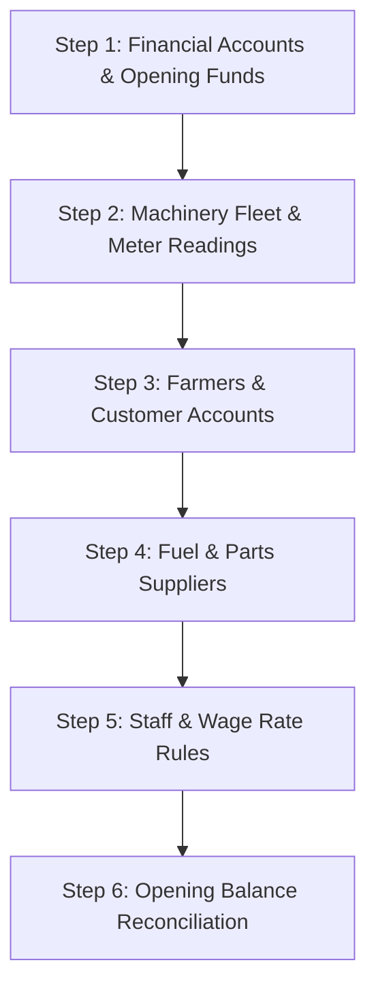

# AgriBOS ERP — Production Master Data Onboarding & Standard Operating Procedure (SOP)

This guide documents the authoritative, safe, and structured process for onboarding real business data into AgriBOS Machinery & Financial ERP.

---

## 1. Safety Principles & Core Rules

1. **No Phantom Operational Income/Expense:** Opening funds, customer opening due balances, and supplier opening payables represent prior state. They initialize accounts and ledger balances without falsely inflating current operating income or expenses.
2. **Authoritative Ledger Rule:** The calculated current balance of any financial account is strictly derived from:
   $$\text{Current Balance} = \text{Opening Balance} + \sum \text{Ledger Credits} - \sum \text{Ledger Debits}$$
3. **Transactional Integrity:** All bulk CSV imports execute inside an atomic database transaction (`transaction.atomic()`). If a single row fails validation during import execution, the transaction rolls back completely to prevent corrupted partial imports.

---

## 2. Recommended Onboarding Order

To ensure foreign key relationships and operational workflows link seamlessly, populate master data in the following exact sequence:

### Step 1: Financial Accounts (`/finance/accounts/add/` or `accounts.csv`)
- Register Cash in Hand, Bank Savings, Bank Current, UPI / Digital Wallet, and Petty Cash accounts.
- Enter the exact opening cash/bank balance as of the business cutoff date.
- Bank account numbers are automatically masked (e.g. `XXXX XXXX 9901`) in general views.

### Step 2: Machinery Fleet (`/machines/add/` or `machines.csv`)
- Register every active Tractor, Harvester, JCB, and agricultural implement.
- Specify the baseline hour-meter or odometer reading (used to compute fuel economy and maintenance intervals).
- Enter unique vehicle registration numbers and purchase details.

### Step 3: Farmers / Customers (`/finance/customers/add/` or `customers.csv`)
- Onboard regular clients with their phone numbers and village locations.
- If a farmer carries an unpaid balance from the prior agricultural season, enter it in `opening_balance`. An opening `Receivable` is created without generating artificial revenue.

### Step 4: Suppliers & Vendors (`/finance/suppliers/add/` or `suppliers.csv`)
- Categorize vendors into `FUEL_PUMP`, `SPARE_PARTS`, `WORKSHOP`, or `OTHER`.
- If the business carries outstanding vendor liabilities from prior months, enter it in `opening_balance`. An opening `Payable` is created without generating artificial expense.

### Step 5: Employees & Wage Configurations (`/employees/add/` and `/employees/wages/`)
- Register machine operators, drivers, technicians, and mechanics.
- Configure authoritative compensation rate rules (`DAILY_WAGE`, `PER_ACRE_COMMISSION`, `MONTHLY_SALARY`).

### Step 6: Reconciliation & Audit (`/finance/setup/reconciliation/`)
- Navigate to the **Opening Balance Reconciliation** dashboard.
- Verify the Master Business Equation:
  $$\text{Net Initial Capital} = \text{Total Opening Cash/Bank} + \text{Customer Opening Receivables} - \text{Supplier Opening Payables}$$

---

## 3. CSV Import Specifications & Templates

AgriBOS supports preview-enabled, validated CSV import at `/finance/setup/`:

| Entity | Template Download Endpoint | Required Columns | Key Constraints |
|---|---|---|---|
| **Machines** | `/finance/setup/templates/machines/` | `name`, `machine_type` | `machine_type` must match valid type code (`TRACTOR`, `PADDY_HARVESTER`, `COMBINE_HARVESTER`, `IMPLEMENT`, `JCB`, `OTHER`); `registration_no` must be unique. |
| **Customers** | `/finance/setup/templates/customers/` | `name` | `opening_balance` must be non-negative numeric; unique `customer_code`. |
| **Suppliers** | `/finance/setup/templates/suppliers/` | `name`, `supplier_type` | `supplier_type` must be `FUEL_PUMP`, `SPARE_PARTS`, `WORKSHOP`, `FERTILIZER`, or `OTHER`. |
| **Employees** | `/finance/setup/templates/employees/` | `full_name`, `role`, `wage_type`, `base_rate` | `role` must be valid role choice; `wage_type` must be `DAILY_WAGE`, `PER_ACRE_COMMISSION`, or `MONTHLY_SALARY`. |
| **Accounts** | `/finance/setup/templates/accounts/` | `account_name`, `account_type` | `account_type` must be `CASH`, `BANK_SAVINGS`, `BANK_CURRENT`, `UPI_WALLET`, or `PETTY_CASH`. |

---

## 4. Master Data Verification Checklist

Before starting daily live transactions, verify the 9 readiness gates on the Master Data Setup Hub (`/finance/setup/`):
- [x] 1. Business Profile: System name, INR currency, and Asia/Kolkata timezone active.
- [x] 2. Financial Accounts: Cash, bank, and UPI wallets initialized.
- [x] 3. Machinery Fleet: All tractors and harvesters registered with meter baselines.
- [x] 4. Machine Billing Rates: Hourly and acre commercial rental rates configured.
- [x] 5. Farmers / Customers: Customer database established with contact villages.
- [x] 6. Suppliers: Diesel outlets and parts workshops linked.
- [x] 7. Staff & Drivers: Operators registered with valid emergency contacts.
- [x] 8. Wage Rules: Active compensation rates configured for all staff.
- [x] 9. Opening Balances Reconciled: Balance sheet starting equity verified.
